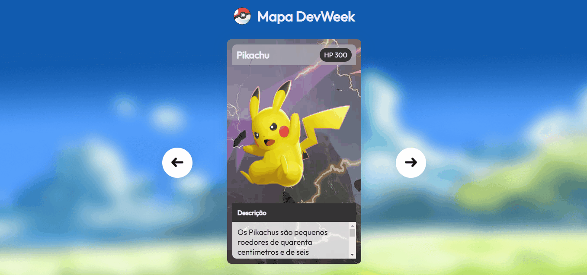

# Projeto Cards Pokemon

Um projeto feito para saber mais sobre o dev em dobro

[]

## Tecnologias utilizadas

- HTML
- CSS(Responsivo)
- JavaScript

## Assuntos que aprendi ao fazer o projeto

- Fazer códigos limpos
- Uma boa organização HTML e CSS
- Iniciando lógica com JS

## Dificuldades que tive

- Dificuldade ao coordenar o HTML e o CSS. 
- Posicionar os elementos e descobrir onde se coloca class. 
- Melhorar a interpretação do código(Observar o layout e fazer o código). Falta mais coordenação.